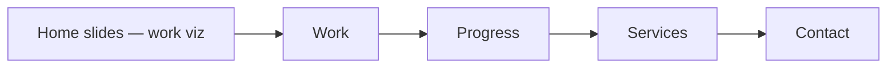

# 01 · CLA · Casa Lica — Architecture client presence

**Thesis:** A **sequential slide experience** on the homepage and key sections walks visitors from *seeing the work* to *understanding engagement* so that by **Services → Contact**, they already know what Casa Lica’s work feels like and what working with the firm entails—then **Brand + portfolio build + deployment** tie that story together as a cohesive product.

*(Assets referenced from Google Drive or a consolidated `CLA` folder can be wired in later; structure below is intentional for your portfolio narrative.)*

---

## 1. Project card

| Field | Fill in |
|-------|---------|
| **Client / project** | Casa Lica (CLA) — architecture presence |
| **Role** | *[e.g. brand, UX/UI, front-end, hosting]* |
| **Timeline** | * |
| **Team** | * |
| **Stack** | *[e.g. Vite/React, static or Node host, CMS if any]* |
| **Outcome** | *[Qualified inquiries + clear firm story]* |

---

## 2. What the client asked for → what shipped

Tell this as two short lists—mirrors stakeholder alignment and your contribution.

### Client intentions (requirements)

*[Examples—you can tighten with real brief language.]*

- A digital presence that **reflects studio quality** (craft, seriousness, differentiation).
- A way to **show work** prominently without drowning visitors in unrelated detail.
- A path toward **conversation**—contact that feels purposeful, not generic.

### What you delivered

| Area | Deliverables |
|------|----------------|
| **Brand identity** | Visual system (logo lockups, type, color, spacing rhythm), verbal tone guidance, usage rules—enough that **site UI and imagery** stay coherent. |
| **Portfolio site** | Information architecture for work, **slide / full-viewport storytelling** patterns, project showcases, responsiveness, accessibility-minded components. |
| **Web hosting / deployment** | Build pipeline, **`cristian-co.com`** (or prod domain), SSL, **`CNAME` / DNS** coordination, production assets. |

---

## 3. Slide-based site structure (“one screen → next” progression)

This is your **distinct UX mechanic**: advancing screens like slides **reveals narrative in order**, building commitment before the heavy ask (*contact*).

### Flow overview

```
Homepage slide experience (work as hero)
       ↓
Work / Portfolio depth (credibility & taste)
       ↓
Progress / Engagement arc (intent & pacing — “how we operate” momentum)
       ↓
Services (what clients can formally expect)
       ↓
Contact form (conversion — visitor is primed)
```

### Screen-by-screen intent

| Segment | Role | What the visitor learns / feels |
|--------|------|--------------------------------|
| **Home — sliding visuals** | *Capture & orient* | The **look and calibre** of the work in motion (or full-viewport transitions). Emotional hook before dense copy. |
| **Work / portfolio** | *Proof* | Specific projects—scale, constraint, outcome. Validates the first-screen promise. |
| **Progress** | *Interest funnel* | A **controlled progression**: firm process, timelines, milestones, collaboration model. Each step raises **confidence** (“I know how this engagement works”). |
| **Services** | *Clarity before commit* | Explicit **what-you-get** framing so the inquiry is typed correctly (fewer stray leads). |
| **Contact** | *Conversion* | Minimal friction matched to **prior context**; microcopy echoes Services + Progress. |

### UX skills that make “progressive slides” effective

- **Pacing**: one dominant idea per view; deliberate **continuation cues** (scroll, swipe, labeled “next” depending on implementation).
- **Orientation**: persistent **minimal global nav** so power users escape the rail without trapping others.
- **Interest gauge hypothesis**: dwell + completion of progression segments implies **warming** intent—optional analytics (slide index reached, `/services` arrival, form start).

---

## 4. Supporting journey layers (beyond the slideshow)

- **Discover** — Referrals, search, direct links; headline/meta match referrer intent.
- **Handoff** — Post-submit email, inbox/CRM routing, internal SLA (document even if informal).
- **Deepen** — Return visits via new projects or editorial—same brand system repeats.

---

## 5. Methods table (skills → evidence)

| Focus | Activities | Portfolio evidence |
|-------|-------------|---------------------|
| Brand | Mood boards, typography scale, accessibility of contrast choices | Guidelines doc, screenshots of cohesive UI |
| IA & narrative | Slide order, labeling, breakpoints | Annotated progression map → Figma or deck |
| Build | Component library, imagery treatment, perf | Repo / live URL |
| Host | Domain, HTTPS, redirects | Brief ops note |

---

## 6. Trade-offs

- **Linear slide UX** maximizes storytelling but can annoy users who want to jump straight to contact—balance with sticky contact or TOC.
- **Heavy imagery** demands **performance budgeting** (lazy load, sizing).
- **Tight narrative** reduces pages for SEO granularity—consider one indexable markdown per mega-section if SEO matters later.

---

## 7. Results & measurement *(fill live)*

- Funnel checkpoints: homepage slide progression depth, `/services`, `form_submit_success`.
- Qualitative: partner feedback (“did inquiries match expectation?”).

---

## 8. Media & artifacts *(populate later)*

- Google Drive / `CLA`: brand PDFs, export screens, staging captures.
- Loom walkthrough of **slide progression**.

---

### Mermaid: intended slide funnel


