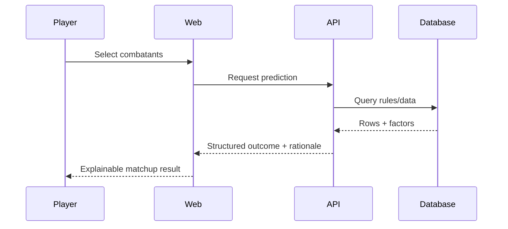

# 02 · Pokey Battle Predictors — Case study + interactive prototype

**Thesis:** A **player-first** predictive tool backed by **Python/Databases**: visitors pick Combatants → see **explainable matchup logic** grounded in structured data → **trust** emerges from transparency of inputs and readable outcomes—for a Pokémon-style competitive prediction experience.

This subpage pairs **engineering narrative** with a **UX case study** anchored in POV (“as a battling player…”).

**Live:** https://cristiancarrasco-git.github.io/Pokebattle-v.1/

**Product surface (for case study copy):** Shipped **PokéBattle** UI — dark battle-lab chrome, Gen 9 trainer tools, format + tier controls, mirrored stat panels, **prediction results** with win-share bar, verdict line, speed insight, then **role tags**, damage-to-%HP ranges, and KO-band readouts; move chips for hypothesis testing.

**Design exploration:** **QUICK:** concept — quick matchup pills, field-conditions rail, dual player columns with EV/nature/item shortcuts, central **PREDICT** / VS spine (aligns narratively with “player agency then commit”).

---

## 1. Project card

| Field | Fill in |
|-------|---------|
| **Project** | Pokey Battle Predictors — matchup prototype |
| **Type** | Portfolio subpage (**case study** + embedded or linked **live prototype**) |
| **Role** | *[Data modeling, backend, UX, front-end tie-in]* |
| **Stack** | *Python*, *database* (SQLite / Postgres—spec yours), *[API or serverless shape]* , *web shell (React/HTML—spec yours)* |
| **Audience POV** | Competitive / casual Pokémon game players evaluating **predictive** duel outcomes |

---

## 2. What you explored → what you shipped

### Problem space

- Players ask *“Given these two Mons and context, **who tends to win**?”* Prediction is inherently **interactive**—users test hypotheticals, not read a wall of stats once.

### What you shipped (for the case study bullets)

| Layer | Narrative beats |
|------|----------------|
| **Data foundation** | **Database designed from scratch in Python-focused workflow**—schemas, ingestion or seed data, matchup-relevant dimensions ( typings, tiers, IV/EV placeholders as appropriate to your scope—be honest ). |
| **Logic / backend** | How predictions are computed or queried *(rules engine, lookups, deterministic formula—whatever you implemented)* ; why Python fit the experimentation loop. |
| **Product surface** | Web UI allowing **comparison interactions** (“swap Pokémon”, “fight”, refresh outcome, maybe history). |
| **UX artifact** | **Case study framing** beside the build: hypotheses, usability notes, iterative layout from **Figma** baseline. |

---

## 3. User journey — Pokémon player POV *(integral narrative)*

Frame every section heading as **They need … / They do … / They feel …**.

### Journey map (minimal)

| Stage | Player goal | Interaction | Emotional / trust outcome |
|-------|-------------|-------------|---------------------------|
| **Land** | “Is this a toy or serious?” | Hero + concise value prop (“predict duel outcomes”) | Curiosity → low skepticism bar |
| **Frame matchup** | “Let me reproduce *my* situation” | Select / search combatants *(and parameters you support)* | Agency |
| **Act** | “Run prediction” | Primary trigger (analyze / battle button) | Anticipation |
| **Interpret** | “Why that result?” | Outcome breakdown—**readable factors** tied to DB fields | Trust if explainable |
| **Explore** | “What if…” | Alternate picks, swaps, resets | Replay value |
| **Exit / share** | “Save or screenshot” | Optional shareable state / copy summary | Satisfaction |

Design principle: predictions for games feel **credibility-sensitive**—surfaces benefit from **transparency controls** (“what assumptions we’re using”), even if simplistic at prototype stage.

---

## 4. Cross-cutting UX case study prompts *(fill alongside Figma)*

Use these headings in your eventual longform or carousel:

1. **Research & assumptions** — What did you infer about how players think about matchups?
2. **Scenario coverage** — Which edges did you knowingly exclude (generation, ruleset, bans)?
3. **Information architecture** — Single-page tool vs Wizard; where DB shape influenced UI grouping.
4. **Interaction design** — Loading states for DB queries, empty states (“pick two Mons”), failure states (unknown species).
5. **Visual system** — Figma baseline: typography, matchup cards, semantic color for winners/losers (mind accessibility).
6. **Validation** *(if any)* — Self-testing, hallway tests, parity checks against manual calcs.

---

## 5. Technical story arc (portfolio readers who scan for craft)

Suggested section order:

1. **Schema first** — ERD-ish description / table list.
2. **Python toolchain** — How you created, migrated, or populated data.
3. **Serving layer** — How the website talks to Python/DB *(REST, local server, static export snapshot—truthful to your artifact)* .
4. **Interaction loop** — Request/response UX tied to latency expectations.
5. **Limitations / next sprint** — Honest backlog reads stronger than overstated claims.

---

## 6. Media checklist

- **Live site** — Done: GitHub Pages (see URL above). Optional: embed screenshot of prediction + breakdown in portfolio.
- **Figma** — QUICK / high-fidelity frames: export hero + dual-panel + predict spine for Work grid thumbnail.
- **ZIP / PDF** — Paths in `guidelines/project-artifacts.md` on your machine.
- **Short clip** — 30–45s: format toggle → run prediction → read damage row (speed insight).
- **Code / repo** — GitHub Pages deploy implies a public repo—link it in the case study when ready.

---

## 7. Design ↔ build alignment

- **Live PokéBattle** — Evidence for “explainable prediction” narrative (numbers, bands, moves).
- **QUICK: concept** — Evidence for IA and progressive disclosure before hitting predict.
- **Portfolio site** — Keep token colors; this project’s *in-app* dark UI stays in screenshots / live link, not necessarily in portfolio CSS unless you choose a themed embed.

---

### Mermaid: player × system

